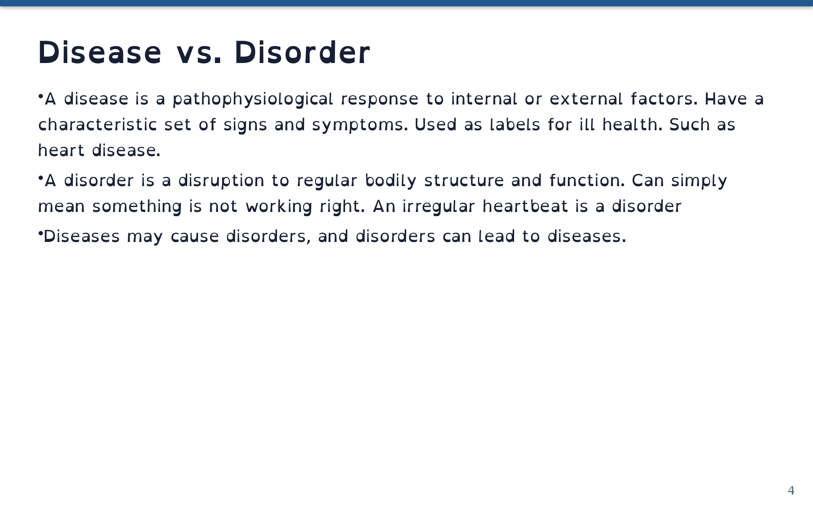

# djot-slides

A Python toolchain for biology instructors and other educators who need editable, lecture-ready
slides from concise Djot source, with native PPTX, ODP, and PDF output.

## One source, editable classroom decks

Write the teaching content once in readable extended-Djot, then make the versions you need for
classroom editing, LibreOffice, and distribution. The repository owns the parser, layout registry,
and exporters, so normal builds use native editable objects rather than a browser or a full-slide
raster stage.

```text
canonical extended-Djot source
  -> repository-owned Djot parser
  -> typed native slide-object model
  -> slide_lib.layouts native layout builders
  -> editable PPTX -> editable ODP -> ODP-derived PDF
```

The included genetics corpus demonstrates the complete path: eight canonical source decks cover
336 visible slides, with text, nested lists, links, images, and a source-derived table retained as
native content. The corresponding [genetics/djot/README.md](genetics/djot/README.md) records the
one-time corpus and all-format acceptance evidence.

## Project status

This is a pre-production, Djot-first presentation pipeline. The native parser, layouts, exports,
and one-time corpus acceptance are complete. An attended LibreOffice Impress click-playback check
for authored reveals remains open, so do not infer animation playback from a successful export or
PDF. See [docs/ROADMAP.md](docs/ROADMAP.md) for the current verification boundary.

<!-- screenshots:begin (managed by screenshot-docs) -->

<!-- screenshots:end -->

This text-only page is an ODP-derived PDF render of the Djot excerpt below. It confirms readable
static output only; it does not prove that slide content is editable or that animations play in
LibreOffice Impress.

## Quick start

This macOS-focused workflow builds one existing lecture deck as an editable ODP. It needs Python
3.12, the packages in `pip_requirements.txt`, and LibreOffice Impress. `brew bundle` installs the
normal Homebrew build/import tools; Poppler is only needed for source-region import, and the pinned
Jotdown validator is a separate dependency for strict-Djot acceptance. Complete details are in
[docs/INSTALL.md](docs/INSTALL.md).

```bash
brew bundle
source source_me.sh && python3 -m pip install -r pip_requirements.txt
source source_me.sh && python3 deck_tools.py build \
  genetics/djot/lect01b-genetic_disorders.djot --format odp
```

The command writes `output/odp/lect01b-genetic_disorders.odp`, which you can open and edit in
LibreOffice Impress. Use `--format pptx`, `--format pdf`, or `--format all` when a different
deliverable is needed.

## What Djot source looks like

Layouts and slots make a slide's teaching structure visible in source. This small excerpt creates a
titled panel with three flat definition bullets; the full 23-slide deck is
[genetics/djot/lect01b-genetic_disorders.djot](genetics/djot/lect01b-genetic_disorders.djot).

```djot
=== layout: one-panel

# Disease vs. Disorder

@body

- A disease is a pathophysiological response to internal or external factors. Have a characteristic set of signs and symptoms. Used as labels for ill health. Such as heart disease.
- A disorder is a disruption to regular bodily structure and function. Can simply mean something is not working right. An irregular heartbeat is a disorder
- Diseases may cause disorders, and disorders can lead to diseases.
```

Run a fast structural check while authoring:

```bash
source source_me.sh && python3 deck_tools.py lint genetics/djot
```

For the pinned native-Djot acceptance lane, run Jotdown before the same semantic lint as described
in [docs/USAGE.md](docs/USAGE.md). Fast lint checks source and referenced assets; it does not prove
visual layout, editable Office output, or attended animation playback.

## Bring forward trusted decks

`deck_tools.py import` is a one-time migration path for trusted instructor-owned ODP or PPTX. It
uses source facts and geometry to select layouts, preserves ordinary content as editable Djot where
supported, and keeps a coupled visual only as a bounded source-region asset when needed. Review the
result once, then maintain the Djot deck as the sole canonical source.

```bash
source source_me.sh && python3 deck_tools.py import genetics/lecture.odp \
  --output genetics/djot/lecture.djot
```

Close LibreOffice before an ODP import or an ODP/PDF build. Import only trusted files: archive and
image validation bounds repository processing, but does not sandbox LibreOffice. The trusted-input
boundary and import constraints are in [docs/INSTALL.md](docs/INSTALL.md) and
[docs/USAGE.md](docs/USAGE.md).

## Documentation

Start here:

- [docs/INSTALL.md](docs/INSTALL.md) - macOS tools, Python environment, and conversion boundary.
- [docs/USAGE.md](docs/USAGE.md) - build, import, lint, and authoring commands.
- [genetics/djot/README.md](genetics/djot/README.md) - source syntax, deck inventory, and corpus
  evidence.
- [docs/ROADMAP.md](docs/ROADMAP.md) - current milestones and open acceptance gates.

Understand the implementation:

- [docs/PIPELINE.md](docs/PIPELINE.md) - artifact flow, owners, authoring contract, and evidence
  lanes.
- [docs/CODE_ARCHITECTURE.md](docs/CODE_ARCHITECTURE.md) - package responsibilities and dependency
  direction.
- [docs/FILE_STRUCTURE.md](docs/FILE_STRUCTURE.md) - repository map and source/artifact boundaries.
- [docs/DESIGN_DECISIONS.md](docs/DESIGN_DECISIONS.md) - settled source, import, and export choices.

## License

Source code is available under the [MIT License](LICENSE.mit).
